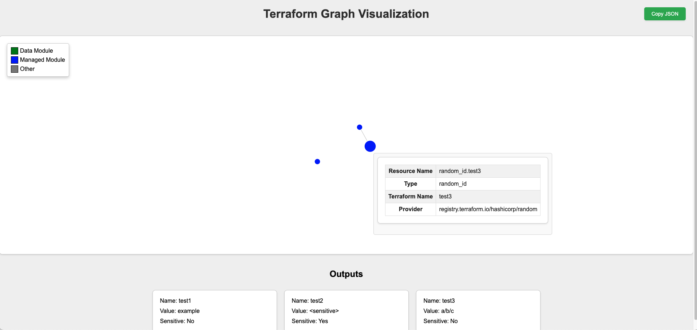

# Terraform Graph Visualizer

Takes a `terraform show` file and generates a visual graph on the web browser.

## Usage

This tool requires a valid JSON `terraform show` file. Generated by:

```bash
terraform show -json > tf.json
```

Then run the tool:

```bash
./terraform-visualizer tf.json
```

This will launch a web server on `http://127.0.0.1:3030` with the visual map.

## Supported Types

- `resource`
  - `depends_on`
- `data`
- `module`
- `variable`
- `output`

## Showcase

This is an example of how the tool translates the JSON output of `terraform show` into a visual graph.:

```json
{
  "format_version": "1.0",
  "terraform_version": "1.6.3",
  "values": {
    "outputs": {
      "test1": {
        "sensitive": false,
        "value": "strongly-uniquely-merry-goat",
        "type": "string"
      },
      "test2": {
        "sensitive": true,
        "value": "factually-oddly-set-mollusk",
        "type": "string"
      }
    },
    "root_module": {
      "resources": [
        {
          "address": "random_id.test3",
          "mode": "managed",
          "type": "random_id",
          "name": "test3",
          "provider_name": "registry.terraform.io/hashicorp/random",
          "schema_version": 0,
          "values": {
            "b64_std": "z12B5Q==",
            "b64_url": "z12B5Q",
            "byte_length": 4,
            "dec": "3479011813",
            "hex": "cf5d81e5",
            "id": "z12B5Q",
            "keepers": null,
            "prefix": null
          },
          "sensitive_values": {},
          "depends_on": [
            "random_pet.test2"
          ]
        },
        {
          "address": "random_pet.test1",
          "mode": "managed",
          "type": "random_pet",
          "name": "test1",
          "provider_name": "registry.terraform.io/hashicorp/random",
          "schema_version": 0,
          "values": {
            "id": "strongly-uniquely-merry-goat",
            "keepers": null,
            "length": 4,
            "prefix": null,
            "separator": "-"
          },
          "sensitive_values": {}
        },
        {
          "address": "random_pet.test2",
          "mode": "managed",
          "type": "random_pet",
          "name": "test2",
          "provider_name": "registry.terraform.io/hashicorp/random",
          "schema_version": 0,
          "values": {
            "id": "factually-oddly-set-mollusk",
            "keepers": null,
            "length": 4,
            "prefix": null,
            "separator": "-"
          },
          "sensitive_values": {}
        }
      ]
    }
  }
}
```
Becomes



## Dependencies

- [serde_json](https://crates.io/crates/serde_json) - JSON parsing
- [tokio](https://crates.io/crates/tokio) - Async runtime
- [warp](https://crates.io/crates/warp) - Web server

## Contributing

This project is open to contributions. Feel free to open an issue or a pull request.
